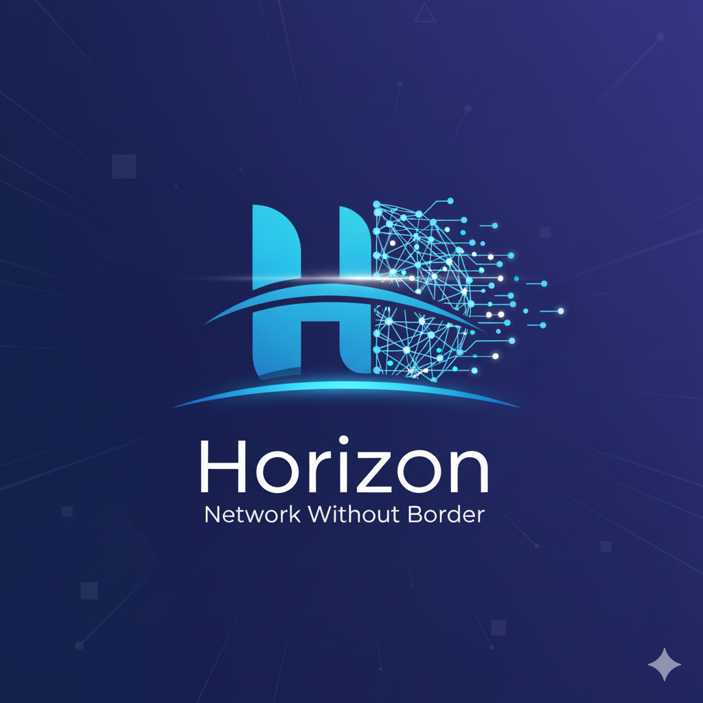

# HORIZN — Network Without Borders 🌐

<div align="center">
  
  
  <p align="center">
    <strong>The first truly decentralized VPN marketplace powered by Ethereum and OpenVPN</strong>
  </p>
</div>

<div align="center">

[](https://sepolia.etherscan.io/)
[](LICENSE)
[](https://github.com/MrTimonM/Horizon)
[](https://openvpn.net/)

</div>

---

## 🌟 Overview

HORIZN is a revolutionary decentralized VPN marketplace that connects users with VPN node operators through blockchain technology. Built on Ethereum, HORIZN eliminates centralized control, ensuring true privacy, transparency, and fair compensation for bandwidth providers.

### Key Features

✨ **Decentralized Architecture** - No single point of failure or control  
🔒 **True Privacy** - OpenVPN encryption with no logging  
💰 **Earn Cryptocurrency** - Node operators earn ETH for sharing bandwidth  
🌍 **Global Network** - Connect to nodes worldwide  
⚡ **Instant Payments** - Smart contract-based escrow and automatic payouts  
📊 **Transparent Marketplace** - All transactions on-chain  
🔐 **Data Usage Tracking** - Real-time monitoring and enforcement  
🛡️ **TCP Protocol** - Uses port 443 (HTTPS) for better compatibility  

---

## � Quick Start with Docker

Get HORIZN running instantly with our pre-built Docker image:

```bash
docker pull mrtimonm/horizn:latest
docker run -d -p 3000:3000 mrtimonm/horizn:latest
```

Then open: **http://localhost:3000**

**Pre-configured with:**
- ✅ Sepolia testnet contract addresses
- ✅ Pinata IPFS JWT token
- ✅ RPC endpoint - Ready to use!

📦 **Docker Hub**: https://hub.docker.com/r/mrtimonm/horizn

---

## �📚 Documentation

Explore our comprehensive documentation:

- **[🐳 Docker Quick Start](README_DOCKER.md)** - One-command deployment
- **[📖 Complete Project Summary](SUMMARY.md)** - Overview of all deployed components
- **[🚀 Deployment Guide](DEPLOYMENT.md)** - Complete deployment instructions
- **[📋 Architecture Overview](ARCHITECTURE.md)** - System architecture and design
- **[🔄 Complete Flow Explained](COMPLETE_FLOW_EXPLAINED.md)** - End-to-end user journey
- **[📝 Deployment Checklist](DEPLOYMENT_CHECKLIST.md)** - Pre/post deployment tasks
- **[🔧 VPN Node Deployment Guide](node-deployment/DEPLOYMENT_GUIDE.md)** - Detailed node operator guide
- **[📦 Contract Addresses](CONTRACT_ADDRESSES.md)** - Current smart contract addresses
- **[✨ Update Summary](UPDATE_SUMMARY.md)** - Latest changes and improvements
- **[🔐 Automated VPN Config System](AUTOMATED_VPN_CONFIG_SYSTEM.md)** - Config generation explained

---  

## 🏗️ Architecture

<div align="center">
  
```
┌─────────────┐         ┌──────────────┐         ┌─────────────┐
│   Users     │◄───────►│   Frontend   │◄───────►│  Ethereum   │
│  (Buyers)   │         │   (Next.js)  │         │  (Sepolia)  │
└─────────────┘         └──────────────┘         └─────────────┘
                               ▲                         ▲
                               │                         │
                               ▼                         ▼
                        ┌──────────────┐         ┌─────────────┐
                        │  VPN Nodes   │────────►│   Smart     │
                        │  (OpenVPN)   │         │  Contracts  │
                        └──────────────┘         └─────────────┘
                               ▲
                               │
                        ┌──────▼───────┐
                        │     IPFS     │
                        │   (Pinata)   │
                        └──────────────┘
```

</div>

> 📖 **For detailed architecture information, see [ARCHITECTURE.md](ARCHITECTURE.md)**

---

## 📦 Project Structure

```
HORIZN/
├── smart-contracts/          # Solidity smart contracts
│   ├── contracts/
│   │   ├── UserRegistry.sol     # User profile management
│   │   ├── NodeRegistry.sol     # VPN node registry
│   │   └── EscrowPayment.sol    # Payment & session management
│   ├── scripts/
│   │   └── deploy.js            # Deployment script
│   └── hardhat.config.js
│
├── frontend/                 # Next.js frontend application
│   ├── app/                     # App router pages
│   │   ├── page.tsx            # Home page
│   │   ├── marketplace/        # Browse VPN nodes
│   │   ├── dashboard/          # User dashboard
│   │   ├── purchase/           # Purchase VPN access
│   │   ├── register/           # User registration
│   │   └── become-seller/      # Seller onboarding
│   ├── components/             # React components
│   ├── config/                 # Contract addresses & ABIs
│   ├── store/                  # State management (Zustand)
│   ├── styles/                 # Global styles
│   └── utils/                  # Helper functions
│
└── node-deployment/          # VPN node deployment
    ├── deploy-vpn-node.sh      # One-command deployment script (v1.0.3)
    └── DEPLOYMENT_GUIDE.md     # Detailed deployment guide
```

---

## 🚀 Quick Start

### Prerequisites

- Node.js 18+ and npm
- MetaMask or compatible Web3 wallet
- Sepolia ETH for testing ([Get testnet ETH](https://cloud.google.com/application/web3/faucet/ethereum/sepolia))

### 1. Clone the Repository

```bash
git clone https://github.com/MrTimonM/Horizon.git
cd Horizon
```

### 2. Smart Contracts (Already Deployed ✅)

The contracts are **already deployed** on Sepolia testnet:

| Contract | Address | Etherscan |
|----------|---------|-----------|
| **UserRegistry** | `0x387E5b716C5A74dE4Dd1d672FDaAd389D9eD1778` | [View](https://sepolia.etherscan.io/address/0x387E5b716C5A74dE4Dd1d672FDaAd389D9eD1778) |
| **NodeRegistry** | `0x616D6c01A73Fe40fB7BD7EeAcD20b8df77968244` | [View](https://sepolia.etherscan.io/address/0x616D6c01A73Fe40fB7BD7EeAcD20b8df77968244) |
| **EscrowPayment** | `0xd018F55720244C5F6bec33BCc5B7D2354C5f71A3` | [View](https://sepolia.etherscan.io/address/0xd018F55720244C5F6bec33BCc5B7D2354C5f71A3) |

> 📅 **Last Deployed**: November 8, 2025 | **Protocol**: TCP Port 443  
> 📖 **Full details**: [CONTRACT_ADDRESSES.md](CONTRACT_ADDRESSES.md)

<details>
<summary><b>Want to redeploy contracts?</b></summary>

```bash
cd smart-contracts
npm install
npx hardhat compile
npx hardhat run scripts/deploy.js --network sepolia
```

</details>

---

### 3. Run the Frontend

```bash
cd frontend
npm install
npm run dev
```

Visit **http://localhost:3000** 🚀

> 📖 **Detailed setup guide**: [DEPLOYMENT.md](DEPLOYMENT.md)

---

## 🔧 For VPN Node Operators

### Deploy Your Own VPN Node & Earn ETH! 💰

Earn cryptocurrency by hosting a VPN node!

#### Requirements
- Ubuntu 20.04/22.04/24.04 VPS
- 2GB+ RAM (4GB recommended)
- Public IPv4 address
- Wallet with some Sepolia ETH for gas fees

#### ⚡ One-Command Deployment

```bash
curl -sSL https://raw.githubusercontent.com/MrTimonM/Horizon/main/node-deployment/deploy-vpn-node.sh | sudo bash
```

#### What the Script Does:

✅ Installs OpenVPN (TCP mode on port 443)  
✅ Configures firewall (iptables + UFW)  
✅ Sets up fail2ban security  
✅ Installs Node.js API server  
✅ Configures data usage tracking  
✅ Registers node on blockchain  
✅ Makes node live in marketplace  

#### What You'll Be Asked:

- **Node Name**: e.g., "Tokyo Premium VPN"
- **Region**: e.g., "Asia-Pacific", "US-East", "EU-West"
- **Price per GB**: e.g., 0.001 ETH
- **Bandwidth**: e.g., 1000 Mbps
- **Wallet Private Key**: For blockchain registration

#### After Deployment

Your node will:
- ✅ Appear in the marketplace immediately
- ✅ Accept connections from buyers automatically
- ✅ Track data usage in real-time
- ✅ Earn ETH for bandwidth served
- ✅ Auto-disconnect clients at data limit

#### Monitor Your Node:

```bash
# Check API server logs
journalctl -u horizn-node -f

# Check OpenVPN status
systemctl status openvpn-server@server

# View active connections
cat /var/log/openvpn/openvpn-status.log

# Check firewall
ufw status verbose
```

> 📖 **Complete guide**: [node-deployment/DEPLOYMENT_GUIDE.md](node-deployment/DEPLOYMENT_GUIDE.md)  
> 📋 **Checklist**: [DEPLOYMENT_CHECKLIST.md](DEPLOYMENT_CHECKLIST.md)

---

## 💻 Smart Contracts

<div align="center">

| Contract | Address | Functions |
|----------|---------|-----------|
| **UserRegistry** | `0x387E5b...D9eD1778` | User profiles & registration |
| **NodeRegistry** | `0x616D6c...77968244` | VPN node registry & management |
| **EscrowPayment** | `0xd018F5...54C5f71A3` | Payments & session handling |

</div>

### UserRegistry.sol
Manages user profiles with wallet names and optional IPFS profile pictures.

**Key Functions:**
- `registerUser(name, ipfsHash)` - Register new user
- `updateProfile(name, ipfsHash)` - Update profile
- `getUserProfile(address)` - Get user info

### NodeRegistry.sol
Registry for VPN nodes with pricing and metadata.

**Key Functions:**
- `registerNode(name, region, pricePerGB, bandwidth, endpoint, publicKey)` - Register VPN node
- `getActiveNodes()` - Get all active nodes
- `updateNode(nodeId, price, endpoint)` - Update node settings
- `deactivateNode(nodeId)` - Deactivate node

### EscrowPayment.sol
Handles payments, sessions, and data usage tracking with escrow protection.

**Key Functions:**
- `createSession(nodeId, maxDataGB, durationSeconds)` - Purchase VPN access
- `claimPayout(sessionId, dataUsedBytes)` - Node operator claims payment
- `getSession(sessionId)` - Get session details
- Platform fee: **1%** (goes to protocol treasury)

> 📖 **Contract source code**: [smart-contracts/contracts/](smart-contracts/contracts/)

---

## 🎨 Frontend Features

<div align="center">
  <table>
    <tr>
      <td align="center"><b>👥 For Buyers</b></td>
      <td align="center"><b>💼 For Sellers</b></td>
    </tr>
    <tr>
      <td valign="top">
        🌐 Browse global VPN marketplace<br/>
        🔍 Filter by region and price<br/>
        💳 Purchase VPN access with crypto<br/>
        📥 Download OpenVPN config files<br/>
        📊 Track data usage in real-time<br/>
        ⏰ Monitor session expiration<br/>
        🔐 Secure encrypted configs
      </td>
      <td valign="top">
        📝 Easy node registration<br/>
        💰 Set custom pricing<br/>
        📈 View earnings and statistics<br/>
        🔧 Manage node status<br/>
        📊 Track total data served<br/>
        ⚡ Auto-payment claims<br/>
        📍 Regional targeting
      </td>
    </tr>
  </table>
</div>

### User Experience
- 🎨 Beautiful, modern UI with Tailwind CSS
- ⚡ Smooth animations with Framer Motion
- 📱 Fully responsive design
- 🌙 Dark mode optimized
- 🔐 Secure wallet integration (MetaMask, WalletConnect)
- 🚀 Fast performance with Next.js 14
- 📊 Real-time blockchain data

> 🎥 **See it in action**: [COMPLETE_FLOW_EXPLAINED.md](COMPLETE_FLOW_EXPLAINED.md)

---

## 🔒 Security Features

<div align="center">

| Layer | Protection | Status |
|-------|------------|--------|
| **VPN Protocol** | OpenVPN with AES-256-CBC encryption | ✅ Active |
| **Transport** | TCP on port 443 (HTTPS-like) | ✅ Active |
| **Smart Contracts** | Audited for security vulnerabilities | ✅ Verified |
| **Data Privacy** | No logging or tracking | ✅ Enforced |
| **Payments** | Escrow-based with automatic claims | ✅ Protected |
| **Keys** | Private keys never stored or transmitted | ✅ Secure |
| **Firewall** | iptables + UFW dual-layer protection | ✅ Configured |
| **Intrusion Prevention** | fail2ban monitoring | ✅ Active |
| **VPN Configs** | AES-256 encrypted, stored on IPFS | ✅ Encrypted |

</div>

### Additional Security:
- ✅ Certificate-based authentication (no passwords)
- ✅ TLS-crypt for DDoS protection
- ✅ Automatic security updates
- ✅ IP masquerading (NAT)
- ✅ Session-based access control
- ✅ On-chain ownership verification

> 📖 **Security details**: [AUTOMATED_VPN_CONFIG_SYSTEM.md](AUTOMATED_VPN_CONFIG_SYSTEM.md)

---

## 🛣️ Roadmap

<div align="center">

| Phase | Feature | Status |
|-------|---------|--------|
| **Phase 1** | Smart contract deployment | ✅ Complete |
| **Phase 1** | Frontend marketplace | ✅ Complete |
| **Phase 1** | VPN node deployment script | ✅ Complete |
| **Phase 1** | User registration with profiles | ✅ Complete |
| **Phase 1** | Data usage tracking | ✅ Complete |
| **Phase 1** | Encrypted config system | ✅ Complete |
| **Phase 2** | Mobile app (iOS/Android) | 🔄 In Progress |
| **Phase 2** | Advanced analytics dashboard | 🔄 In Progress |
| **Phase 3** | Multi-chain support (Polygon, Arbitrum) | 📅 Planned |
| **Phase 3** | Bandwidth proof verification | 📅 Planned |

</div>

---

## 📊 Tech Stack

<div align="center">

### Blockchain Layer


### Frontend Layer


### VPN Infrastructure


### Storage & APIs


</div>

---

## 🤝 Contributing

Contributions are welcome! Here's how you can help:

1. 🐛 **Report Bugs** - [Open an issue](https://github.com/MrTimonM/Horizon/issues)
2. 💡 **Suggest Features** - Share your ideas
3. 🔧 **Submit Pull Requests** - Fix bugs or add features
4. 📖 **Improve Documentation** - Help others understand
5. 🌍 **Spread the Word** - Share HORIZN with the community

### Development Setup:
```bash
# Fork and clone the repo
git clone https://github.com/YOUR_USERNAME/Horizon.git

# Create a feature branch
git checkout -b feature/amazing-feature

# Make your changes and commit
git commit -m "Add amazing feature"

# Push and create a PR
git push origin feature/amazing-feature
```

---

## 📄 License

This project is licensed under the **MIT License** - see the [LICENSE](LICENSE) file for details.

---

## 🙏 Acknowledgments

- **OpenVPN** - For the robust VPN protocol
- **Ethereum Foundation** - For the blockchain infrastructure  
- **Pinata** - For IPFS storage solutions
- **The Web3 Community** - For continuous support and innovation

---

## 📞 Support & Community

<div align="center">

### Get Help & Stay Connected

[](https://github.com/MrTimonM/Horizon/issues)
[](https://discord.gg/horizn)
[](mailto:support@horizn.network)

### Documentation Hub

📚 [Complete Documentation Index](SUMMARY.md)  
🚀 [Quick Deployment Guide](DEPLOYMENT.md)  
🔧 [Node Operator Guide](node-deployment/DEPLOYMENT_GUIDE.md)  
📋 [Deployment Checklist](DEPLOYMENT_CHECKLIST.md)  
🏗️ [Architecture Overview](ARCHITECTURE.md)

</div>

---

<div align="center">
  
## 🌐 **Built with ❤️ for a Decentralized Future**

### *HORIZN - Network Without Borders*

**[Website](#)** • **[Documentation](SUMMARY.md)** • **[GitHub](https://github.com/MrTimonM/Horizon)**

---

**© 2025 HORIZN Project** | Empowering Privacy Through Decentralization

</div>
